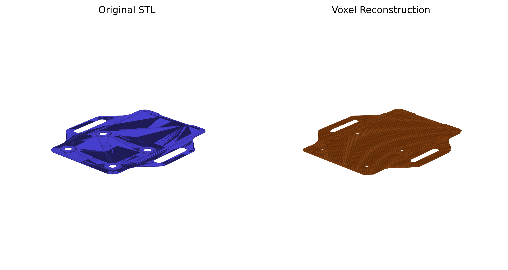
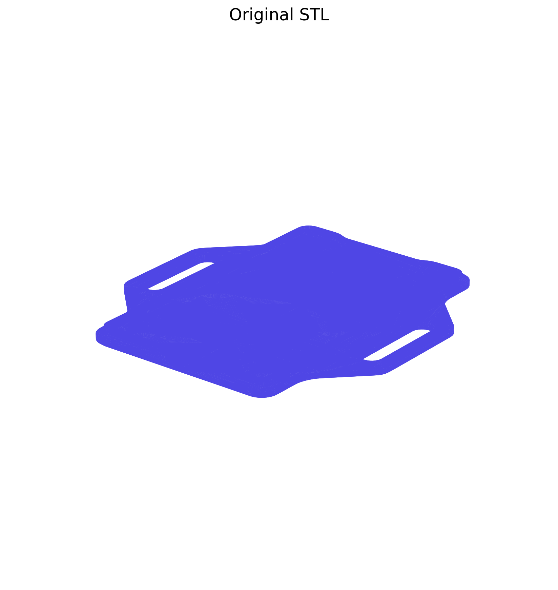

# STL To STEP Experiments

This repo now has two separate tracks:

- [`stl-to-step-voxel`](./stl-to-step-voxel): the current working voxel and slice-band reconstruction workflow
- [`stl-to-step-ga-hybrid`](./stl-to-step-ga-hybrid): the next-gen genetic-algorithm plus local-optimization approach

Local test meshes belong in the git-ignored `input/` folder at the repo root.

## Before / After

The `before` image below is the original STL mesh. The `after` image is the current voxel-based reconstruction preview.

More images:

- 
- 

## Which folder should you open?

Use [`stl-to-step-voxel`](./stl-to-step-voxel) if you want to:

- run the current fitter
- inspect your local STL inputs and the current reconstruction
- use the Gradio UI

Use [`stl-to-step-ga-hybrid`](./stl-to-step-ga-hybrid) if you want to:

- work on the search-based CAD program synthesis idea
- evolve operation sequences
- mix discrete mutation with continuous parameter refinement

## GA Timelapses

Bottom enclosure run:

Top enclosure run:

